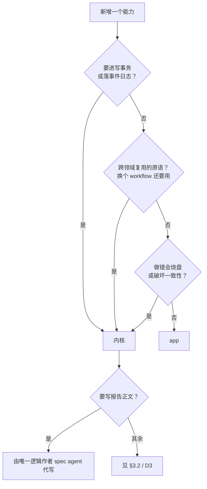

# Kernel ↔ App 能力边界（#955）

本文回答三个问题：**系统的边界在哪里**（什么必须留在内核，判据是什么）、
**系统为 app 提供哪些 tool**（双向能力清单）、**app 的表达边界在哪**
（能表达什么、不能表达什么、为什么）。新 PR 判断"这个能力该放哪"时直接
引用本文的 §1 判据与 §3 拦截清单，不再重开个案讨论。

伴生文档：`docs/architecture/terminology-glossary.md`（术语）、
`docs/upgrade-stability.md`（Tier A/B 持久化契约）、`docs/sync-engine-design.md`
（写路径 / 授权）。姊妹 issue：#800（内核内部事实源边界，不同轴）。
#489（plugin origin/trust/capability 分层）建立在本文之上。

> 术语：本文的 "app" 与代码里的 "plugin" 同义（`crates/calm-server/src/plugin_host/`）。
> 面向用户的叫法是 app；代码与 manifest 里是 plugin。

## 0. 边界的性质：能力/审计边界，不是 OS 安全边界

先把最重要的定性写死，后文一切"拦截"都在这个前提下成立：

**本文描述的膜是能力与审计边界，作用对象是本机安装、安装即隐式受信的
协作代码；它不是针对恶意代码的 OS 安全边界。** 事实依据：

- plugin 子进程由内核直接 exec manifest 指定的可执行文件，**全量继承内核
  环境**（`plugin_host/process.rs:94-96`，有意为之，无 `env_clear`、无
  seccomp/namespace 沙箱），仅叠加 `NEIGE_PLUGIN_TOKEN` / `NEIGE_PLUGIN_ID`
  / `NEIGE_PLUGIN_DATA_DIR` 三个内核注入（manifest env 之后应用，不可被
  覆盖）；
- 因此一个恶意 plugin 进程可以用服务进程用户的 OS 权限直接做文件/网络/
  进程副作用——包括绕过 §2.3 的 forge-action 降级自己执行副作用、直接
  碰 SQLite 文件。RPC 门禁**管不了这些**。

膜的真实承诺是三条，全部以"plugin 走内核提供的通道"为前提：

1. 走通道的写**必有归因与审计**（actor 注入、事件化写路径）；
2. 走通道的写**必过门禁**（manifest permissions、role_gate、fail-closed
   scope）——权限模型的粒度与语义在通道上是完备的；
3. 内核拥有的不变量（CRDT 合并、Tier-A 校验、配额、GC）**只在内核实现
   一份**，plugin 无需也无法在进程内复制它们。

对不受信来源代码的进程级隔离（OS sandbox、凭据隔离、文件系统隔离）是
#489（origin/trust）要立的独立防线，不在本文范围。本文所有"✗ 拦截"
应读作"通道上不存在此能力"，而非"进程做不到"。

---

## 0.1 全景

三个平面、三条穿越边界的通道、四道拦截。

```text
┌─ agent 层 ──────────────────────────────────────────────
│  spec agent              worker (codex / claude)
└──┬──────────────────────────────────┬────────────────────
   │ calm.*                           │ ③ plugin.<id>_<tool>
   │ 内核自有工具                     │    内核代理
   ▼                                  │    fail-closed
╔═ 内核平面 ═════════════════════════ │════════════════════
║  事实源与授权    event log · role_gate · ActorId
║  可恢复副作用    operation · scheduler · gate
║  持久化契约      Tier-A payload (wave-report / codex / claude / terminal / spec)
║  内容寻址存储    wave_vcs (commit 链 / diff / GC)
║  app 宿主        进程监管 · MCP stdio · ui:// 资源
╚══▲═════════════════════════════════ │═════════════════════
   │ ①                                │ ②
   │ neige.* ×10                      │ tools/call
   │ 受 manifest permissions 门禁     │ resources/read
   │                                  ▼
┄┄┄┼┄┄┄┄┄┄┄┄┄┄┄┄┄ 边 界 膜 ┄┄┄┄┄┄┄┄┄┄┄┄┄┄┄┄┄┄┄┄┄┄┄┄┄┄┄┄┄┄┄┄┄
   │   ✗ 改内核拥有的卡           ✗ 写 wave_vcs / wave FS
   │   ✗ 定义可执行 gate          ✗ 绕过 role_gate
   │                                  │
┌──┴──────────────────────────────────┴─ app 平面 (plugin) ─
│  exposes_tools · workflow descriptor · ui://<plugin>/<view>
│  overlay (kind 自定义) · 私有 kv (配额) · event.subscribe
└─────────────────────────────────────────────────────────
```

```text
①  app → 内核    neige.* 回调（overlay×2 / card×3 / event×1 / kv×4），
                 逐条受 manifest.permissions 门禁（plugin_host/callbacks.rs）
②  内核 → app    tools/call（透传 + forge-action 降级 + 建卡）；
                 resources/read 语义上是内核自己解析 ui://，不出进程
③  agent → app   内核把 plugin 工具代理成 plugin.<id>_<tool>，
                 可见性由 plugin_scope_for_wave fail-closed 决定
```

> 与 issue #955 全景图的差异（本文以代码为准）：回调是 ×10 不是 ×9
> （kv 是 4 个方法）；Tier-A 卡清单是 `wave-report / codex / claude /
> terminal / spec`（`spec` **是**注册的内建 card kind，
> `card_kind/builtins.rs`——但活着的 spec agent 卡是 `codex` kind +
> `CardRole::Spec` 角色，两者并存，见 §1.2）。

---

## 1. 系统的边界在哪里

### 1.1 判据

一个能力，三条测试任一为真 → **内核**；三条全否 → **app**：

1. **要不要进写事务 / 落事件日志？** 事实源和审计只能有一处
   （`role_gate` 在写事务内执行，违规整体回滚）。
2. **是不是跨领域复用的原语？** 换一个 workflow 还要用 → 内核。
   只有一个消费者 → app。
3. **做错了会不会烧盘、破坏一致性？** app 不能自管磁盘配额与 GC。



用一个真实场景（个股投研 workflow）跑一遍：

```text
裸数据存档 + 版本化   T1 是(进 wave_vcs 写事务) ────────────→ 内核 · 缺写入口(见 D3)
文档批注 / 讨论       T1 否 → T2 否 → T3 否 ──────────────→ app  · 不缺(overlay + ui://)
到期提醒             T1 否 → T2 否(仅一个消费者) → T3 否 ──→ app  · 不缺(kv + 自带 timer)
文档正文 in-place 改  T1 是(改 Tier-A 卡) ──────────────────→ 内核 · app 不直写
```

### 1.2 内核持有

- **事实源与授权**：event log（`events` 表 + `events.actor` 持久化
  `ActorId`）、`role_gate`（`crates/calm-truth/src/role_gate.rs`，写事务内
  硬闸）、MCP 入口软闸（`registry.rs` `require_role*` + `visible_to_roles`）
- **可恢复副作用**：operation / scheduler / gate 执行（plugin 的
  forge-action 也降级为 operation 后由内核执行，见 §2.3）
- **持久化契约**：Tier-A payload（`docs/upgrade-stability.md` §Tier A）。
  内核拥有的内建 card kind：`terminal` / `codex` / `claude` / `wave-report`
  / `spec`，外加 `ui://` 前缀命名空间（`crates/calm-truth/src/card_kind/
  builtins.rs`）。注意一处易混淆：`spec` 既是注册的 card kind，也是
  `CardRole::Spec` 角色——**活着的 spec agent 是 `codex` kind 的卡 +
  Spec 角色**，`spec` kind 是另一张内核铸造卡；引用时分清 kind 与 role。
- **agent 驱动**：spec harness、dispatcher、worker 生命周期
- **内容寻址存储**：`wave_vcs`（commit 链只从事件追加路径写入，
  `crates/calm-truth/src/db/sqlite/events.rs`；GC 由内核后台任务负责；
  对外 trait 只暴露读 + 三个 admin 修剪口）
- **app 宿主**：进程监管（spawn / crash / token 握手）、MCP stdio 传输、
  `ui://` 资源（内核自己从 install dir 读 HTML，**不**经 plugin 进程往返，
  `plugin_host/resources.rs`）、沙箱 iframe 的 CSP 投影

### 1.3 现状里一个直接的误导：`aspect.rs`（D1 → 删除）

`crates/calm-server/src/aspect.rs` 是 14 行空壳（`AspectRegistry`，
"currently has no installed join points"）。它面向的是内核不变量、不是
plugin，却占着"切面"这个词——下一个想找 plugin 扩展点的人还会踩。

**结论（D1）：删除。** 理由：它没有任何 join point、没有消费者；"未来
内核不变量注册表"这个用途等真出现第一个不变量时再立文件，届时叫
`kernel_invariants.rs`，不叫 aspect。占位抽象违反"先有真实消费者"原则。
删除属 ≤200 行清理；④ 后来也因没有真实消费者而撤回，两者遵循同一原则。

---

## 2. 系统为 app 提供哪些 tool（双向清单）

### 2.1 ① app → 内核：`neige.*` 回调（`plugin_host/callbacks.rs`）

身份规则是安全脊柱：`plugin_id` 由内核从连接注入（`CallbackCtx`），
**从不信任**参数里的 `plugin_id`；每笔事件化写以 `ActorId::Plugin(id)`
落审计。

| 回调 | 作用 | 门禁（`plugin_host/perms.rs`） |
|---|---|---|
| `neige.overlay.set` / `.delete` | 给 wave/card 挂结构化附加数据 | `permissions.overlays_write` 限 `entity_kind ∈ {wave, card}`（双重：注册表 `plugin_writable` + manifest 允许列表）；`overlay_kind` 由 plugin 自定义、不受门禁，但内核拥有的 overlay kind 仍过 `validate_overlay_payload`。**已知缺口**：overlay payload 无每-plugin 字节配额（kv 有、overlay 没有），按判据 3 属同类，记录在案待治理 |
| `neige.card.create` | 建卡 | `permissions.cards_create` + kind 必须是 `terminal` 或 `plugin:<self_id>:` 前缀；一律以 `deletable=true` 落库（plugin 铸不出内核拥有的不可删卡） |
| `neige.card.update` | 改卡 | 仅 `kind` 以 `plugin:<self_id>:` 开头（`can_card_modify`；terminal 即便是自己创建的也不行）；改 kind 需同时过 `can_card_create`（防 patch 绕过）；payload 过 `validate_card_kind_global` |
| `neige.card.delete` | 删卡 | 同 `can_card_modify`，且 `deletable` 硬闸先行（内核拥有的卡在 kind 检查之前就拒绝） |
| `neige.event.subscribe` | 订阅事件 topic，内核 push `neige.event` 通知 | `permissions.events_subscribe` 逐 glob 精确匹配（不做 glob 包含推理；空 filter 视为 firehose、需 `"*"` 授权）；慢消费者掉事件不背压内核 |
| `neige.kv.get/set/list/delete` | 每 plugin 私有持久化 KV | `permissions.kv_quota_bytes`（默认 1 MiB，set 前投影计算配额） |

共 10 个方法。**审计边界要说准**：overlay×2 + card×3 五个变更方法走
`write_with_event_typed` 事件化写路径且 `CallbackCtx.repo` 被收窄为
`RouteRepo`（原始同步域写在类型层不可达）；`kv.set/delete` 是**不落
事件的裸写**（plugin 私有命名空间，键值不进审计日志，只受配额）——
这是有意取舍，但属于边界事实：受审计 = overlay/card 写，不受审计 =
kv 写。`kv.get/list` 与 `event.subscribe` 无持久写。

### 2.2 ②′ iframe → 内核（`POST /api/plugins/:id/tool-call`）

同一个 `neige.*` 词表的第二个入口，三道门依次：

1. 硬命名空间闸：`name` 必须 `neige.` 开头（plugin 自己的工具从 iframe
   永远不可达）；
2. plugin 必须 Running；
3. manifest 每 view 的 `permissions.tools` 允许列表（deny-by-default，
   glob 语法同 events；当前实现是跨 view 取并集——任一 view 授权即放行，
   view_id 尚未穿透到该路由，#198 已记录）。

然后进 §2.1 同一个 `callbacks::dispatch`，correlation 标
`user_tool_call:<id>`。此路由无 cookie/token；CORS 只约束浏览器，任何
本机进程都能 POST——真正的栅栏是 `neige.` 命名空间闸 + manifest 允许
列表 + §0 的"本机安装即受信"前提，不是网络层。

### 2.3 ③ agent → app：内核代理（`mcp_server/transport.rs`）

- 铸名：`plugin.<plugin_id>_<tool>`（`_` 是无歧义分隔符，plugin id 禁含
  `_`）。tools/list 与 tools/call 双路都过唯一豁口
  `plugin_scope_for_wave`（`mcp_server/tool_visibility.rs`）。
- `ToolKind` 留空 → 直通代理：内核转发 `tools/call` 到 plugin 的 MCP
  server，结果原样返回。plugin 可包任意外部数据源 / CLI。
- `ToolKind::ForgeAction` → **不是**直通：额外要求 `trusted_forge_plugin`，
  且 plugin 只返回结构化的 `PluginForgePayload`（argv + idem_key + probe），
  由内核降级成 operation 执行。这条通道的价值是**归因与可恢复性**（副
  作用进 operation runtime，有幂等键、有 parked/await 语义），不是阻止
  进程自行动手（见 §0——协作代码走这条路是为了拿到内核的恢复语义）。
- 拒绝语义：scope 不允许时复用 `unknown_tool()` 错误——绑定 wave 里
  探测不到其他 plugin 工具的**存在性**（不是权限不足，是不存在）。

### 2.4 声明式插槽（manifest，`plugin_host/manifest.rs`）

`exposes_tools[]`（name / input_schema / annotations / kind）、
`workflows[]`（`plan_template` / `gates` / `spec_instructions` ≤8KB /
`input_schema` 受限子集 / `card_kinds` 禁撞内建）、`views[]`（scope 闭集
`["card"]`；wave/cove scope 明确拒绝）、`entrypoint{command,args,env}`
（禁绝对路径与 `..`）、`permissions{}`（缺省 = 最严限制）。

### 2.5 信任判定的现状（如实记录，改造归 #489）

"trusted" 今天是**纯 env 允许列表**：`NEIGE_TRUSTED_FORGE_PLUGINS`，
未设时默认 `dev.neige.git-forge`（`forge_trust.rs`）。无签名、无 DB 位、
无 UI。它与"显式配置优于隐式 env 开关"的项目共识相悖，是 #489
（origin / trust / ownership 数据化）要替换的第一目标。本文只锁定其
**语义**：trust 是内核判定、fail-closed 消费（§2.3、§3.2），任何后继
实现必须保持这两点。

---

## 3. app 的表达边界在哪

### 3.1 能表达

- 自己的 card kind + 沙箱 iframe UI（`ui://<plugin>/<view>`）
- 挂在任意 wave/card 上的 overlay（kind 自定义）
- 一条 workflow：任务图、输入表单 schema、注入 spec prompt 的指令、
  建议性 gate
- 暴露给 agent 的工具（直通代理可包任意外部数据源；forge-action 降级
  为内核 operation）
- 私有持久化 KV + 事件订阅——组合起来足以自带 timer、做到期触发

### 3.2 不能表达（通道上不存在的能力；四道拦截不是待补的洞，是边界本身）

| 拦截 | 位置 | 为什么对 |
|---|---|---|
| 改内核拥有的卡（`wave-report` / `codex` / `claude` / `terminal` / `spec`） | `perms.rs` `can_card_modify` 前缀检查 + `deletable` 硬闸 | 否则 CRDT 合并（#960 block 文档）、Tier-A schemaVersion 校验、`WaveReportEdited` 编辑日志三样一起失守。④ proposal 曾试图在此开切面，但它把 app 变成第三个报告写者，引入丢更新、撤销安全、顺序版本、租约等复杂度，又没有真实消费者，故已撤回[^proposal-residue] |
| 写 `wave_vcs` / wave FS | 无回调（词表里没有 VCS 形状的方法；wave_vcs 写入只从事件追加路径可达） | 配额与 GC 只能有一个负责人（判据 3） |
| 定义**可执行**的 gate | `manifest.rs` `WorkflowDescriptor::gates` 明注 "Advisory, prompt-only … NEVER executed as a shell command" | 真 gate 由 spec 从目标仓库工具链经 `calm.plan.upsert` 写；否则 manifest 成了远程执行面 |
| 绕过 `role_gate` / 审计（对 overlay/card 写而言） | `CallbackCtx.repo` 收窄为 `RouteRepo`（raw 同步域写类型不可达）+ 写事务内 `enforce_role` | 写路径唯一（判据 1）。kv 裸写是记录在案的例外（§2.1） |

一条**防御纵深观察**（非行为变化，留给 #489）：硬闸 `enforce_role` 对
`ActorId::Plugin` 在 `WaveUpdated` / dispatch 类事件上是放行的
（`role_gate.rs` 注释明言 unrestricted）——今天安全，因为 §2.1 的回调
词表根本没有能发这些事件的方法，纵深依赖"词表封闭"这一事实。#489 落
capability gate 时应把这层收紧为 deny，使两层独立成立。

[^proposal-residue]: 撤回 ④ 后仍有事件面残留：`Event::ProposalSubmitted` /
    `Event::ProposalResolved` 保留为只读变体；`EditAuthor::Plugin` 与
    `author_plugin_id` 永不移除；manifest 的 `permissions.proposals` 仍解析但
    忽略；`role_gate` 的两条 proposal 条款作为防御纵深保留。

### 3.3 两个值得单独拎出来的表达限制

**(a) 一个 wave 只能绑一个 workflow，绑定不可变。**
`wave.workflow_id: Option<String>` 单值、仅 wave 创建时设置、无 rebind
API（唯一的创建后变更是 launchpad 归一化清空）。`plugin_scope_for_wave`
对已绑定 wave 返回 `Only(plugin_id)`，fail-closed：

```text
wave.workflow_id = None                 wave.workflow_id = Some("equity-research")
        │                                        │
        ▼                                        ▼
  scope = All                              scope = Only("dev.neige.invest")
        │                                        │
        ├─ ✓ plugin.invest_*                     ├─ ✓ plugin.invest_*
        ├─ ✓ plugin.forge_*                      ├─ ✗ plugin.forge_*   ← 不可见
        └─ ✓ plugin.<任意 running>_*              └─ ✗ plugin.<其他>_*  ← 不可见

  绑定的 wave 里，另一个 app 的工具连 tools/list 都看不到——不是权限不足，是不存在。
  workflow 归属 plugin 停机 / 失信 / wave 查不到 → scope = None（零 plugin 工具），
  不回退到 All。
```

**后果：两个 app 无法在同一个 wave 里协作。** 这是当前最硬的表达上限，
由 #761（workflow 组合）解决；本文只负责把它写下来。

**(b) app 无法直接修改内核文档正文。**
wave-report 的全部写口（`calm.report.write/edit` + `calm.report.blocks.*`）
都是 `require_role(Spec)`；REST 侧唯一例外是人（`EditAuthor::User`）。
"只有 spec 能改报告"今天只活在 MCP 入口软闸，硬闸 `role_gate` 对
wave-report 没有条款——plugin 反正够不着（§3.2 第一行），但这条不变量
没有第二层。这条限制成立，不是待补的洞。app 通过 ③ 工具向 agent 提供
数据与建议，由 spec agent 以报告唯一逻辑作者的身份判断是否写入、如何
组织；overlay 与 `ui://` 承载不应进入报告正文的 app 内容。另做一份
`ui://<plugin>/report` 会重建 CRDT 合并、块级 rev、编辑日志、用户改动
唤醒 spec、`report.md` 投影——**这是分叉产品，不是扩展**。

---

## 4. 单写者原则

> **报告只有一个逻辑作者：spec agent。** 人可以直接覆写；人的编辑唤醒
> spec 去调和。app 通过工具（③）、overlay、`ui://` 贡献，不写报告文档。

准确说，这是**单一逻辑作者 + 人可覆写**。app 若直接或经裁决后落笔，会成为
第三个写者；即使机械上能合并，多个写者拼出的报告也没有一个主体对取舍与
组织负责。agent 代写保留这层编辑判断以及既有门禁。

**规范化范围**：本原则只约束 **wave-report 文档**。plugin 自有命名空间的
card、terminal card、overlay、`ui://` 界面、dispatcher/worker 路径以及其他
内核状态不在范围内。内核为持久化、迁移所作的机械写入也不算“作者”。

**这是策略，不是机制（如实记）**：今天报告 CRDT 的写者包括 spec MCP 与
REST 人工编辑；spec 身份按会话区分，双开即两个活的 spec 写者。整文档写路径
`Replace` / `WriteMarkdown` 也没有 `if_rev`，spec 与人的并发编辑实际是
last-writer-wins（整文档写路径补 `if_rev` 已开 #979）。因此单写者是产品策略
与设计纪律，并非代码强制的不变量；机制化并发控制应另行设计，不能假称本文
已经保证。

## 5. 附录：曾经考虑过的 ④ proposal 方案（已撤回）

以下保留当时的 wire 形状、状态机与安全约束，仅供 #489 在未来真的出现
受限信任层及真实消费者时取用，**不是当前能力或实施计划**。方案撤回的原因是：
它仍让 app 成为报告的第三个写者，复杂度集中在多写者的丢更新、撤销安全、
id/顺序版本、seen 归因与租约问题；同时没有真实消费者，违反“先有真实消费者”
原则。原 D2 裁决是 report-only、wire 形状可扩展；现行结论以 §3.2、
§3.3(b) 与 §4 为准。

### 5.1 复用什么

代码库里最近的"agent 提议 → 人裁决"机器是 **ratify**
（`calm.ratify.request` → `Event::RatifyRequested` → 人走 REST →
`Event::RatifyResolved{Grant|Deny}`）。proposal 沿用其**权威模型**
（提议方永远无法自我**批准**——plugin 对自己的单只有收回权
（withdrawn，§5.6），accept/reject/stale 一律 user-only；裁决路由
in-tx 重查 pending → 409，与 `routes/cards.rs` ratify 处理器同构），但**不照搬**其状态
推导——ratify 是每 wave 单槽（`ORDER BY id DESC LIMIT 1`），proposal
是每 wave 多单，见 §5.6。

### 5.2 wire 形状（可扩展的最小面）

④ 给 `neige.*` 词表加三个方法，统一由新 manifest 字段
`permissions.proposals`（允许列表限 subject kind；缺省空 = 三个方法
都不可用）门禁：

```jsonc
// 读基线：plugin 现有词表没有任何 report 读口，提议必须有可锚定的基线。
// 注意 manifest 里休眠的 `cards_read_all` 权限位（今天无任何回调消费它）
// 将来若接了通用 card 读口会旁路这里的 proposals 门禁——届时该位与
// permissions.proposals 的关系必须显式裁定，先记录在案。
"neige.report.get" { "wave_id": "w_…" }
→ { "blocks": [{ "id", "kind", "rev", "payload" }], "doc_heads": "…" }
   // doc_heads = 该快照的 Automerge canonical heads 编码（不透明字符串，
   // ReportDoc 包一层 get_heads 的确定性排序+哈希编码）

"neige.proposal.submit" {
  "subject": { "kind": "report", "wave_id": "w_…" },   // kind 是唯一的扩展点
  "base_doc_heads": "…",     // 必填：来自 neige.report.get 的不透明基线锚
  "ops": [ /* ProposalOp 列表，见 5.2.1 */ ],
  "note": "为什么提这个改动（渲染给人看）",
  "idem_key": "…"            // 必填：dedup 只对 pending 生效——同
                             // (plugin, wave, idem_key) 已有 pending 单则
                             // 返回其 proposal_id；已裁决的单释放该键。
                             // 已知残余：提交后旋即被裁决、plugin 重试同键
                             // 会铸出第二张 pending 单——锚定校验保证它
                             // 不会二次落笔，最多多一张待人清理的废单
}
→ { "proposal_id": "pp_…" }

// 撤回：只能撤自己的 pending 单（防 B-N1 的配额卡死）
"neige.proposal.withdraw" { "proposal_id": "pp_…" }
→ {}
```

- **subject 是唯一扩展点**：今天只接受 `kind: "report"`；未来加 kind 时
  wire 不变（先有真实消费者，别空转抽象——与 D1 同一原则）。
- **配额（硬性，submit 时拒绝）**：单 proposal 序列化 ≤ 64 KiB、
  ops ≤ 32 条、note ≤ 4 KiB；每 (plugin, wave) 同时 pending ≤ 4。
  proposal 进的是 append-only 事件日志（Tier-A 永久数据），没有上限就
  是烧盘通道（判据 3）；数值可调，上限本身不可省。pending 计数在
  **submit 写事务内**对事务一致的来源（同事务更新的投影，或直接
  in-tx 数事件）执行——投影若允许滞后，并发提交就能冲破上限。
  配额卡死有两个出口：plugin 主动 `withdraw`，或对 pending 单重用
  `idem_key` 拿回原单自行撤后重提。

#### 5.2.1 ProposalOp：专用 DTO，不复用工具层的宽松形状

`calm.report.blocks.*` 的工具 DTO 为交互式 agent 优化（upsert-create
无锚、move 的 `if_rev` 可选、目标是数字下标——无关插入会让下标语义
漂移而所有块 rev 仍匹配）。proposal 是**异步**提议，锚定必须完备，
所以定义收紧的 `ProposalOp`：

- `UpsertBlock { block_id? | temp_id?, kind, payload, if_rev(改必填), anchor }`
  ——改既有块用 `block_id`；新建块**不带** `block_id` 而带
  `temp_id`（proposal 内唯一的字符串），持久 id 由**内核**在 apply 时
  分配；批内后续 op 的 `anchor.after_block_id` 可写 `temp:<temp_id>`
  引用先前新建的块。位置用 `anchor: { after_block_id | at_start |
  at_end }` 表达，不用数字下标；
- `MoveBlock { block_id, if_rev(必填), anchor }`；
- `DeleteBlock { block_id, if_rev(必填) }`；
- **不含** `WriteMarkdown` / `Replace`（全文覆写与字符串匹配不可提议）。

**锚定与 stale 判定（apply 事务内，权威）**：

- 块级为主：每个 op 的 `if_rev` 必须匹配、anchor / 目标块必须存在
  （unknown block id 同样算 stale，不是 400）。块级锚定让提议在
  spec 活跃编辑**无关块**时仍可接受——这是不用整文档锚做权威判定
  的理由。
- `base_doc_heads` 补位：现模型没有整数文档 rev，`ReportDoc` 持久化的
  是 Automerge 字节 + 块级 rev，所以整体锚是**不透明的 Automerge
  canonical heads 编码**（由 `neige.report.get` 快照发出，apply 时与
  当前 doc heads 比较）。它对两类没有块级锚的 op 是权威的：纯
  `at_start` / `at_end` 创建（doc 变过 → stale）；对其余 op 仅作 UI
  预检提示，不参与权威判定。
- op 序列语义：**顺序校验-应用**——每个 op 在前序 op 应用后的文档
  状态上校验（临时引用名因此可被后续 op 的 anchor 引用；同一块
  delete-then-move 这类矛盾序列自然失败）。
- **任何**权威校验不满足 → 整单 stale（§5.6），**内核不做提议的自动
  rebase**；app 收到 stale 后基于新快照重提（换新 `idem_key`，见 §5.2
  ——pending 才占键）。

#### 5.2.2 apply 原子性：Batch 是新的持久化入口

现有 `persist_report` 契约是"一次一个 `ReportDocOp`"；对 ops 数组逐条
调用会产生部分接受 + 多对事件。因此 ④ 需要一个**事务化批量 apply**
（`ReportDocOp::Batch(Vec<…>)` 或等价的专用入口）：单事务内从基线
snapshot 出发**顺序校验-应用**全部 op（语义见 §5.2.1——每个 op 在
前序 op 应用后的状态上校验）→ 任一失败全部回滚 → 恰好一对
`CardUpdated` + `WaveReportEdited`。`guard_non_prose_stomp` 等既有防线
在该入口内同样生效。这是 ④ 对 #960 持久化层的唯一扩展要求。

### 5.3 归因（attribution 是本切面的不变量）

事件链完整记录三个身份，每个事件的 actor 明确钉死：
`ProposalSubmitted` actor = `ActorId::Plugin(id)`；`ProposalResolved`
actor = `ActorId::User`（withdrawn 除外，= `ActorId::Plugin(id)`，
§5.4）；accept 事务内代为落笔的 `CardUpdated` + `WaveReportEdited`
actor = `ActorId::Kernel`，plugin 归因由 `author="plugin"` +
`author_plugin_id` 承载。同事务混合 actor 会使对应 `wave_vcs` commit
的 author 为 NULL——这是既有的 mixed-actor 语义，接受。不得把 plugin
的提议改动归因成 User 或 Spec。

`WaveReportEdited.author` 的扩展**不是**普通加变体：`EditAuthor` 今天
是三个无字段变体、序列化为裸小写字符串（`"spec"|"user"|"kernel"`，
`Copy`）。带数据的 `Plugin(String)` 会改变 wire 形状。**裁决：保持裸
字符串编码，新增无字段变体 `"plugin"`，plugin 身份放在
`WaveReportEdited` 新增的兄弟字段 `author_plugin_id: Option<String>`**
（仅 `author=="plugin"` 时非空）。`Copy`、既有比较点、旧事件回放全部
不受扰动；前端 zod / goldens / invalidationPolicies 照 Tier-A 流程加。
`ProposalSubmitted` / `ProposalResolved` 两个新事件自身同样走完整
Tier-A 事件流程（goldens min/full、zod、event-version 说明）。

### 5.4 role_gate：新增条款，不改既有条款

§5.5 的"不动 role_gate"**只指不改既有条款**。ratify 的裁决之所以硬，
是因为 `role_gate` 对 `RatifyResolved` 有 User-only 硬条款；proposal
必须对等，否则 user-only 只是路由入口检查，违背 §1.1 判据 1（授权在
写事务内成立）。新增两条 in-tx 硬条款：

- `ProposalSubmitted`：仅 `ActorId::Plugin(id)`，且事件 payload 里的
  plugin_id 必须等于 actor 的 id（role_gate 只见 (event, actor)，
  连接注入本身发生在回调层——硬闸比较的是这两个字段）；
- `ProposalResolved{accepted|rejected|stale}`：仅 `ActorId::User`
  （stale 也是人触发 accept 时由内核判定的裁决结果，§5.6）；
- `ProposalResolved{withdrawn}`：仅 `ActorId::Plugin(id)`。所有权检查
  分两层——`enforce_role` 是纯函数、只见 `(actor, event, scope)`，
  查不了投影，所以 `ProposalResolved` 事件 payload 携带提交者
  plugin_id，硬闸比较 actor id 与该字段；**pending 且确属该 plugin**
  的事实性校验由 withdraw 的事务化处理器在同一写事务内完成（与
  accept 的 in-tx pending 重查同构，withdraw 与 accept 并发时先提交
  者胜、后者 409）。

按当时的历史方案表述，这会是 §3.2 纵深观察的第一次兑现：新事件从第一天起
两层门禁独立成立；现行方案并未兑现该收紧，仍留给 #489。

### 5.5 权限与生命周期检查点

- **submit 时**：manifest `permissions.proposals` 含 subject kind；
  subject 存在（wave 存在且未终结、report 卡存在）；配额未超。不要求
  plugin 拥有该 wave 绑定的 workflow——overlay 同样是"任意 wave 可挂"，
  proposal 的安全性来自人裁决，不来自 wave 归属；#489 若要收紧到
  bound-workflow-only，是纯粹的 submit 前置检查加法。
- **accept/reject 时**：不再重查 plugin 权限、不要求 plugin 在运行甚至
  在安装——pending 在事件日志里，不在 plugin 进程里；提议在提交时刻
  合法即可裁决，UI 对已卸载 plugin 渲染其 id。裁决检查的是**事实**：
  in-tx pending 重查（已裁决 → 409）、wave/report 仍存在且 wave 未
  终结（wave 已删 → 404；已删或已终结的 wave 的 pending 单变为不可
  accept——注意 `WaveDeleted` 是追加事件、历史事件行**不会**消失，
  所以投影负责在 WaveDeleted / 终结时移除或隐藏这些 pending 行；对
  已终结 wave 的 accept 尝试落 stale，与"裁决检查事实"一致）、
  §5.2.1 全部锚定校验。
- **plugin 观察裁决**：`ProposalResolved` 进事件总线，plugin 用既有
  `neige.event.subscribe` 订阅（topic `proposal:*`，需 manifest
  `events_subscribe` 相应授权）实现 stale 后重提；不新增专用回调。
- **pending 列表 / 详情**：REST（user-facing，随 ④ 的 PR 定型路由）；
  UI 以 #960 D3 的"改前块 / 改后块"并排呈现，accept / reject 两键。

### 5.6 状态机（终态齐全，事件词表两只、决议四种）

```text
                    ┌──────────────────────────────────────────────────────┐
  ProposalSubmitted │ pending                                              │
  (actor=Plugin)    └──┬──────────────┬──────────────┬──────────┬──────────┘
                       │ user accept  │ user accept   │ user     │ plugin
                       │ 校验全过      │ 任一锚定失败   │ reject   │ withdraw
                       ▼              ▼               ▼          ▼
              ProposalResolved  ProposalResolved  ProposalResolved  ProposalResolved
              {accepted}        {stale}           {rejected}        {withdrawn}
              + CardUpdated
              + WaveReportEdited(author=plugin)
              ―――――――― 同 一 个 写 事 务 ――――――――
```

- 事件只有两种（`ProposalSubmitted` / `ProposalResolved`），决议四种
  （`accepted` / `rejected` / `stale` / `withdrawn`——最后者是 plugin
  自己收回 pending 单的唯一途径，防止配额被废单永久占死）。stale
  不是第三种事件也不是
  持久标记，而是 accept 尝试在事务内锚定校验失败时落下的决议——
  在此之前 proposal 一直是 pending，UI 可以在渲染时对 pending 做
  非权威的 live rev 预检提示"可能已过期"，但**权威判定只发生在
  accept 事务内**。
- **accepted 的决议事件与 report 变更（§5.2.2 Batch apply）在同一个
  写事务提交**——内核在 resolve 与 apply 之间崩溃不可能产生"已裁决
  未落笔"或"已落笔仍 pending"。这是 proposal 与 ratify 的本质差异
  （ratify 决议无副作用），也是必须写死的一条。
- 幂等：submit 幂等键见 §5.2；resolve 的幂等由 in-tx pending 重查保证
  （重复 accept → 409）。
- pending 推导：事实源仍是事件日志，但"每 (wave, proposal_id) 最新
  事件"的 group-by 不适合每次全量扫描——落一张**可重建的投影表**
  （或带索引的派生视图），事件日志保持唯一 truth，投影允许随时从
  日志重放重建。配额（§5.2）同时兜住投影与渲染的规模上限。

### 5.7 spec 的关系

accept 后的 `WaveReportEdited(author=plugin)` 必须唤醒 spec——报告是
spec 的工作产品，plugin 改了它 spec 必须知道。**现状 dispatcher 的
谓词只推送 `author == EditAuthor::User` 的报告编辑**
（`dispatcher/mod.rs`），所以 ④ 需要显式把该谓词扩为
`User | Plugin`（含相应的循环抑制与测试），仅加 enum 变体不会自动
获得此行为。

### 5.8 非目标（本切面不做）

- 不放宽 `can_card_modify`——proposal 正是它的替代；
- 不做任意实体 proposal（D2 裁决：先 report-only）；
- 不做提议自动合并 / rebase；
- 不改 `role_gate` **既有**条款（新增 proposal 两条见 §5.4）、不动
  Tier-A 既有契约；
- 不引入新的隐式 `NEIGE_*` env 开关（`permissions.proposals` 走 manifest，
  与其余门禁同构）；
- 不做进程级沙箱（§0 的定性；归 #489）。

---

## 6. 开放问题裁决记录

| # | 问题 | 裁决 | 理由 |
|---|---|---|---|
| D1 | `aspect.rs` 去留 | **删除** | 空壳占词，无消费者；见 §1.3 |
| D2 | proposal 做多通用 | **已被 D5 supersede**（原裁决：report-only，wire 可扩展） | 原 wire 留在 §5，仅作历史参考 |
| D3 | wave FS 可写 `data/` 落地后要不要 `neige.wave.put` | **部分被 D5 supersede；仍不给直写** | 不开第二条写 `wave_vcs` 的路：配额与 GC 归属要重想，且 app 想存东西已有 kv；原裁决中“未来表达为 proposal subject kind”的出口由 D5 撤回，app 也可用③、overlay 或 `ui://`。若未来真出现该需求，届时按 §1.1 判据重新裁决内核写入口 |
| D4 | app 自带 timer 要不要内核兜底 | **接受静默丢失** | 只有一个消费者，按判据 2 不构成内核原语；plugin 熔断后到期任务丢失的可见性问题留给 #489 的 plugin 健康面 |
| D5 | 报告写者模型 | **单一逻辑作者 + 人可覆写；撤回 ④** | spec agent 对报告整体负责；app 经 ③、overlay、`ui://` 贡献。**本项 supersede D2，并 supersede D3 中“未来以 proposal subject kind 写入”的结论**；D3 的“不开放 `neige.wave.put` 直写”仍成立。历史 wire 仅留 §5 附录供 #489 参考 |

## 7. 验收对照（issue #955）

- 三条判据 → §1.1；双向能力清单 + "做不到"清单及理由 → §2 / §3.2；
- 两个表达限制 → §3.3；报告单写者原则 → §4 / D5；撤回的 proposal wire
  仅作历史附录 → §5；`aspect.rs` 结论 → §1.3 / D1；
- #489 可直接建立在 §0（边界定性 / 进程隔离缺口）、§2.5（trust 现状
  语义）与 §3.2（纵深观察）之上；若未来出现受限信任层与真实消费者，
  可取用 §5 的历史 wire 形状。

## Related

- #489 plugin origin / trust / capability 分层（后继，依赖本文；承接
  §0 进程隔离、§2.5 trust 数据化、§3.2 role_gate 收紧；§5 历史 wire
  仅在出现受限信任层与真实消费者时供取用）
- #800 内核内部概念模型与事实源边界（姊妹篇，不同轴）
- #761 workflow 组合（解 §3.3(a) 的单绑定上限）
- #960 wave-report block 文档（现行报告写路径基础；④ 撤回后不再要求
  §5.2.2 历史方案中的 Batch apply）
- #330（closed）"Neige 需要的是产出与证据，不是协作文档平台"——§1.1
  判据的动机
